## 前言

此文档聚焦于科普OCR技术的原理和应用场景。

## 基本概念和应用

OCR (Optical Character Recognition)，即“光学字符识别”。

OCR是一种技术，它使用光学和机器学习技术来识别和提取印刷或手写文本中的字符。这项技术允许计算机系统理解图像中的文字，将其转换为可编辑文本或其他数字形式。

OCR广泛用于许多领域，包括文档数字化、图书馆管理、自动数据输入、扫描仪和复印机技术、车牌识别、手写文字识别等。通过使用OCR，人们可以将印刷或手写的文本从纸张、照片或其他媒体中转换为可编辑的数字文本，从而方便进行文本搜索、编辑和存储。

通过google找到的有关OCR的科普，来自[amazon](https://aws.amazon.com/cn/what-is/ocr/) （当然夹带了它的私货——给自己的OCR产品打广告）

下面一部分是它的内容汇总：

## OCR如何工作

OCR 引擎或 OCR 软件通过以下步骤工作：

### 图像采集

扫描仪读取文档并将这些文档转换为二进制数据。OCR 软件分析扫描的图像，将淡色区域分类为背景，将深色区域分类为文本。

### 预处理

OCR 软件首先清理图像并删除错误，以为读取做好准备。以下为其使用的一些清理技术：

- 扫描期间，对扫描文档进行轻微的偏移校正或倾斜，以修复对齐问题。
- 去除杂点、移除数字图像斑点或平滑文本图像边缘。
- 清理图像中的边框和线条。
- 多语言 OCR 技术的脚本识别

### 文本识别

OCR 软件用于文本识别的 OCR 算法或软件流程的两个主要类型为模式匹配和特征提取。

### 模式匹配

模式匹配分离字符图像（称为标志符号），并将其与存储的类似标志符号进行对比。模式匹配仅在存储的标志符号与输入的标志符号具有类似字体和大小时才能发挥作用。对于以已知字体输入的文档的扫描图像，此方法效果很好。

### 特征提取

特征提取将标志符号分割或分解为线条、闭环、线条方向和线条焦点等特征。然后，其使用这些特征在存储的多种标志符号中查找最佳匹配或最相近的匹配。

### 后处理

分析后，系统将提取的文本数据转换为计算机化的文件。某些 OCR 系统可以创建带注释的 PDF 文件，内含扫描文档的扫描前后版本。

## OCR的类型

### 简单光学字符识别软件

简单 OCR 引擎存储许多不同的字体和文本图像模式作为模板。OCR 软件使用模式匹配算法将文本图像与其内部数据库进行逐字符对比。如果系统逐字匹配文本，则称为光学文字识别。此解决方案存在限制，因为字体和手写风格几乎无限多，数据库中无法捕获和存储每个单独类型。

### 智能字符识别软件

现代 OCR 系统使用智能字符识别 (ICR) 技术，以像人类一样阅读文本。其使用机器学习软件，采用训练机器像人类一样行为的高级方法。机器学习系统，又称神经网络，在多个级别分析文本并反复处理图像。其查找不同的图像属性（例如曲线、线条、交点和环），并结合所有这些不同级别的分析结果获得最终结果。即使 ICR 在处理图像时每次通常只处理一个字符，但速度很快，数秒内即可获得结果。

### 智能文字识别

智能文字识别系统与 ICR 的工作原理相同，但其处理的是整个文字图像，而不是将图像预处理为字符。

### 光学标记识别

光学标记识别识别文档中的徽标、水印和其他文本符号。

## OCR的优势

### 可搜索的文本

企业可以将其现有的和新的文档转换为完全可搜索的知识归档。也可以使用数据分析软件自动处理文本数据库，进行进一步的知识处理。

### 运营高效

您可以使用 OCR 软件自动集成企业内的文档工作流和数字工作流，进而提高效率。以下是 OCR 软件的一些应用示例：

- 扫描手填表格，用于自动化验证、审核、编辑和分析。这节省了手动文档处理和数据输入所需的时间。
- 通过快速搜索数据库中的字词查找需要的文档，而不必手动寻找文件盒中的文件。
- 将手写备注转换为可编辑的文本和文档。
   

### 人工智能解决方案

OCR 通常是企业可能实施的其他人工智能解决方案的组成部分。例如，其在自动驾驶汽车中扫描和读取车牌号和路牌，检测社交媒体文章中的品牌徽标，或者识别广告图像中的产品包装。这些人工智能技术帮助企业做出更好的营销和运营决策，从而降低费用和提升客户体验。

再来一篇知乎上找的比较硬核的[文章](https://zhuanlan.zhihu.com/p/45376274)，下面是汇总内容：

文中首先提到了OCR面对自然场景的不足，解决办法是使用——场景文字识别技术(Scene Text Recognition, STR)，当然这可以作为扩展内容去了解一下。

## OCR的技术路线

典型的OCR技术路线如下图所示：

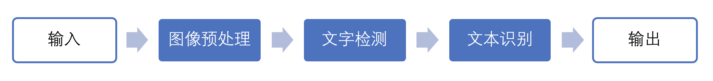

其中影响识别准确率的技术瓶颈是文字检测和文本识别，而这两部分也是OCR技术的重中之重。

在传统OCR技术中，图像预处理通常是针对图像的成像问题进行修正。常见的预处理过程包括：几何变换（透视、扭曲、旋转等）、畸变校正、去除模糊、图像增强和光线校正等。

文字检测即检测文本的所在位置和范围及其布局。通常也包括版面分析和文字行检测等。文字检测主要解决的问题是哪里有文字，文字的范围有多大。

文本识别是在文本检测的基础上，对文本内容进行识别，将图像中的文本信息转化为文本信息。文字识别主要解决的问题是每个文字是什么。识别出的文本通常需要再次核对以保证其正确性。文本校正也被认为属于这一环节。而其中当识别的内容是由词库中的词汇组成时，我们称作有词典识别(Lexicon-based)，反之称作无词典识别(Lexicon-free)

### 图像预处理

传统OCR基于数字图像处理和传统机器学习等方法对图像进行处理和特征提取。常用的二值化处理有利于增强简单场景的文本信息，但对于复杂背景二值化的收效甚微。

传统方法上采用HoG对图像进行特征提取，然而HoG对于图像模糊、扭曲等问题鲁棒性很差，对于复杂场景泛化能力不佳。由于深度学习的飞速发展，现在普遍使用基于CNN的神经网络作为特征提取手段。得益于CNN强大的学习能力，配合大量的数据可以增强特征提取的鲁棒性，面临模糊、扭曲、畸变、复杂背景和光线不清等图像问题均可以表现良好的鲁棒性。

下图是基于CNN(LeNet-5)的文字识别[1]

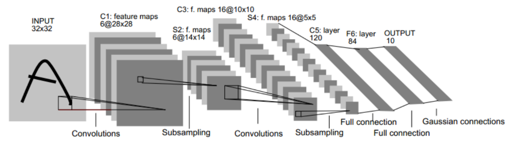

[1] Lécun Y, Bottou L, Bengio Y, et al. Gradient-based learning applied to document recognition[J]. Proceedings of the IEEE, 1998,86(11):2278-2324.

### 文字检测

对于文字检测任务，很自然地可以想到套用图像检测的方法来框选出图像中的文本区域。常见的一些物体检测方法如下：

**Faster R-CNN** Faster R-CNN采用辅助生成样本的RPN（Region Proposal Networks）网络，将算法结构分为两个部分，先由RPN 网络判断候选框是否为目标，再经分类定位的多任务损失判断目标类型，整个网络流程都能共享卷积神经网络提取的的特征信息，节约计算成本，且解决Fast R-CNN 算法生成正负样本候选框速度慢的问题，同时避免候选框提取过多导致算法准确率下降。对于受限场景的文字检测，Faster R-CNN的表现较为出色。可以通过多次检测确定不同粒度的文本区域。[2]

下图为Faster R-CNN的网络结构[2]

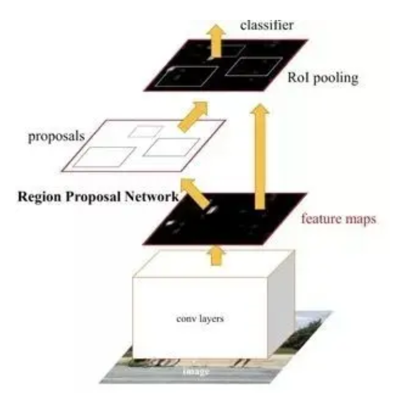

[2] Ren S, Girshick R, Girshick R, et al. Faster R-CNN: Towards Real-Time Object Detection with Region Proposal Networks[J]. IEEE Trans Pattern Anal Mach Intell, 2015,39(6):1137-1149.

**FCN** 相较于Faster R-CNN 算法只能计算ROI pooling 层之前的卷积网络特征参数，R-FCN 算法提出一种位置敏感分布的卷积网络代替ROI pooling 层之后的全连接网络，解决了Faster R-CNN 由于ROI Pooling 层后面的结构需要对每一个样本区域跑一次而耗时比较大的问题，使得特征共享在整个网络内得以实现，解决物体分类要求有平移不变性和物体检测要求有平移变化的矛盾，但是没有考虑到候选区域的全局信息和语义信息。[3]所以当面对自然场景的通用OCR，适于多尺度检测的FCN较之Faster R-CNN有着更好的表现。当采用FCN时，输出的掩膜可以作为前景文字的二值图像进行输出。

下图为FCN的网络结构[3]（评论说此图不属于该论文中）

![FCN的网络结构[3]](./src/FCN.png)

[3] Lin T Y, Dollar P, Girshick R, et al. Feature Pyramid Networks for Object Detection[J]. 2016:936-944.

但是与其他日常场景的物体检测所不同的是，文字图像的分布更接近于均匀分布而非正态分布，即文字总体的均值图像并不能体现文字这一抽象概念的特征。除此之外，文字的长宽比与物体的长宽比不同，导致候选锚定框不适用；文字的方向仍然不能确定，对非垂直的文字方向表现佳；自然场景中常出现一些结构与文字非常接近，导致假阳性率升高。因此需要对现有模型进行调整。

一种常见的做法是调整候选锚定框，例如

**RRPN** (Rotation Region Proposal Networks)在faster R-CNN的基础上，将垂直的候选锚定框进行旋转满足非垂直文本的检测，这样一来就可以满足非垂直文字的检测需求。[4]

下图为RRPN的网络结构[4]

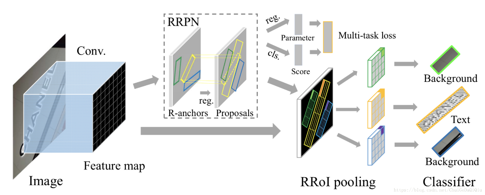

[4] Ma J, Shao W, Ye H, et al. Arbitrary-Oriented Scene Text Detection via Rotation Proposals[J]. IEEE Transactions on Multimedia, 2017,PP(99):1.

**TextBoxes**是基于SSD改进的一个算法。调整了锚定框的长宽比，以适应文字的高长宽比。输出层也利用了利用非标准的卷积核。更适应文字细长的宽高比这一特点。[5]

下图为TextBoxes的网络结构[5]

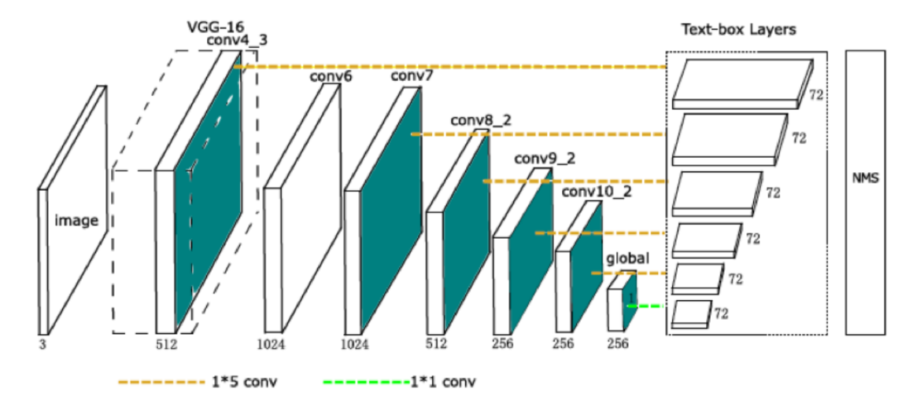

[5] Liao M, Shi B, Bai X, et al. TextBoxes: A Fast Text Detector with a Single Deep Neural Network[J]. 2016.

而**DMPNet** (Deep Matching Prior Network)采用非矩形四边形的候选锚定框进行检测。通过Monte-Carlo方法计算标注区域与矩形候选框和旋转候选框的重合度后重新计算顶点坐标，得到非矩形四边形的顶点坐标。[6]

下图为DMPNet生成候选锚定框的示意图[6]

[6] Liu Y, Jin L. Deep Matching Prior Network: Toward Tighter Multi-oriented Text Detection[C]//: IEEE Conference on Computer Vision and Pattern Recognition, 2017.

另一种改进的方法是通过自底向顶的方法，检测细粒度文本后将其连接成更粗粒度的文本

**CTPN**(Connectionist Text Proposal Network)是目前应用最广的文本检测模型之一。其基本假设是单个字符相较于异质化程度更高的文本行更容易被检测，因此先对单个字符进行类似R-CNN的检测。之后又在检测网络中加入了双向LSTM，使检测结果形成序列提供了文本的上下文特征，便可以将多个字符进行合并得到文本行。[7]

下图为CTPN的网络结构[7]

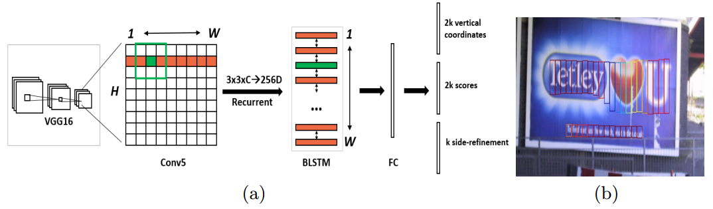

[7] Tian Z, Huang W, He T, et al. Detecting Text in Natural Image with Connectionist Text Proposal Network[C]//: European Conference on Computer Vision, 2016.

**SegLink**则是在SSD的启发下得出的。采用临近连接的方法对上下文进行连接。并且通过将连接参数的学习整合进了神经网络的学习过程，使得模型更容易训练。[8]

下图为SegLink的网络结构[8]

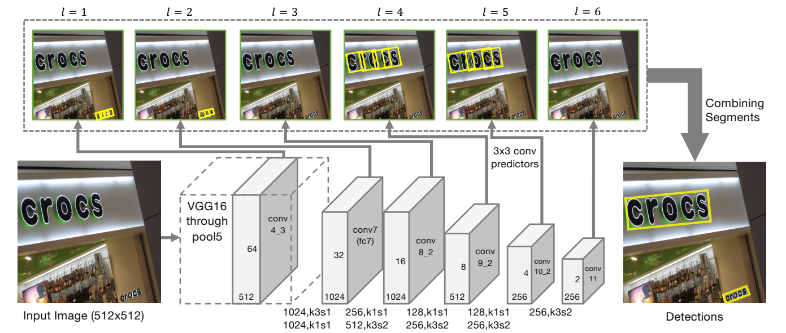

有一些研究引入了注意力机制，如下图模型采用Dense Attention模型来对图像的权重进行评估。这样有利于将前景图像和背景图像分离，对于文本内容较之背景图像有着更高的注意力，使检测结果更准确。[9]

[9] Gao Y, Chen Y, Wang J, et al. Reading Scene Text with Attention Convolutional Sequence Modeling[J]. 2017.

### 文本识别

文本识别在传统技术中采用模板匹配的方式进行分类。但是对于文字行，只能通过识别出每一个字符来确定最终文字行从内容。因此可以对文字行进行字符切分，以得到单个文字。这种方式中，过分割-动态规划是最常见的切分方法。由于单个字符可能会由于切分位置的原因产生多个识别结果，例如“如”字在切分不当时会被切分成“女_口”，因此需要对候选字符进行过分割，使其足够破碎，之后通过动态规划合并分割碎片，得到最优组合，这一过程需要人工设计损失函数。还有另一种方法是通过滑动窗口对每一个可能的字符进行匹配，这种方法的准确率依赖于滑动窗口的滑动窗尺寸，如果滑动窗尺寸过大会造成信息丢失，而太小则会使计算力需求大幅增加。

以上的传统方法通过识别每个单字符以实现全文的识别，这一过程导致了上下文信息的丢失，对于单个字符有较高的识别正确率，其条目识别正确率也难以保证。以身份证识别为例，识别18位的身份号的场景下，即使单字符识别正确率高达99%，其条目正确率只能到0.9918=83%，如果切分也存在1%的损失（即正确率99%），条目正确率则只有(0.99*0.99)18=70%。

因此引入上下文的信息，成为了提升条目准确率的关键。从深度学习的角度出发，要引入上下文这样的序列信息，RNN和LSTM等依赖于时序关系的神经网络是最理想的选择。

下图为CNN+Softmax/ CNN+RNN+CTC/ CNN+RNN+Attention机制

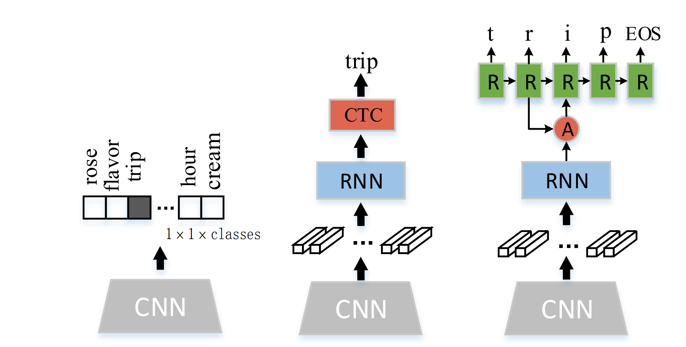

#### 几种典型的文本识别网络结构

常见的一种做法是利用CRNN模型。以CNN特征作为输入，双向LSTM进行序列处理使得文字识别的效率大幅提升，也提升了模型的泛化能力。先由分类方法得到特征图，之后通过CTC对结果进行翻译得到输出结果。[10]

下图为CRNN的网络结构[10]

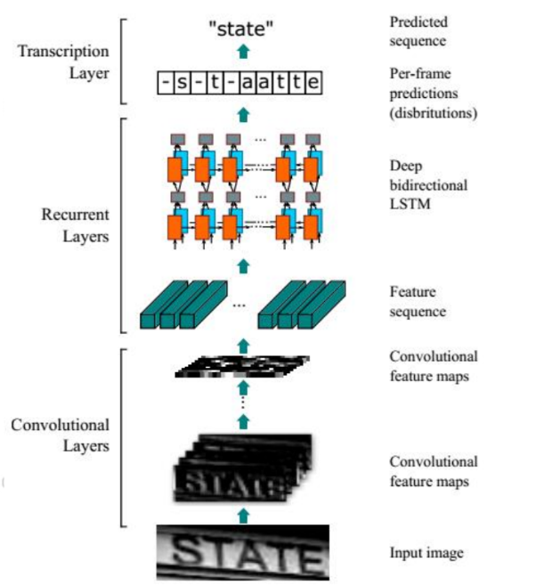

[10] Shi B, Bai X, Yao C. An End-to-End Trainable Neural Network for Image-based Sequence Recognition and Its Application to Scene Text Recognition[J]. IEEE Transactions on Pattern Analysis & Machine Intelligence, 2016,39(11):2298-2304.

另一种方法是引入注意力机制。以CNN特征作为输入，通过注意力模型对RNN的状态和上一状态的注意力权重计算出新一状态的注意力权重。之后将CNN特征和权重输入RNN，通过编码和解码得到结果。[11]

下图为Attention OCR的网络结构[11]

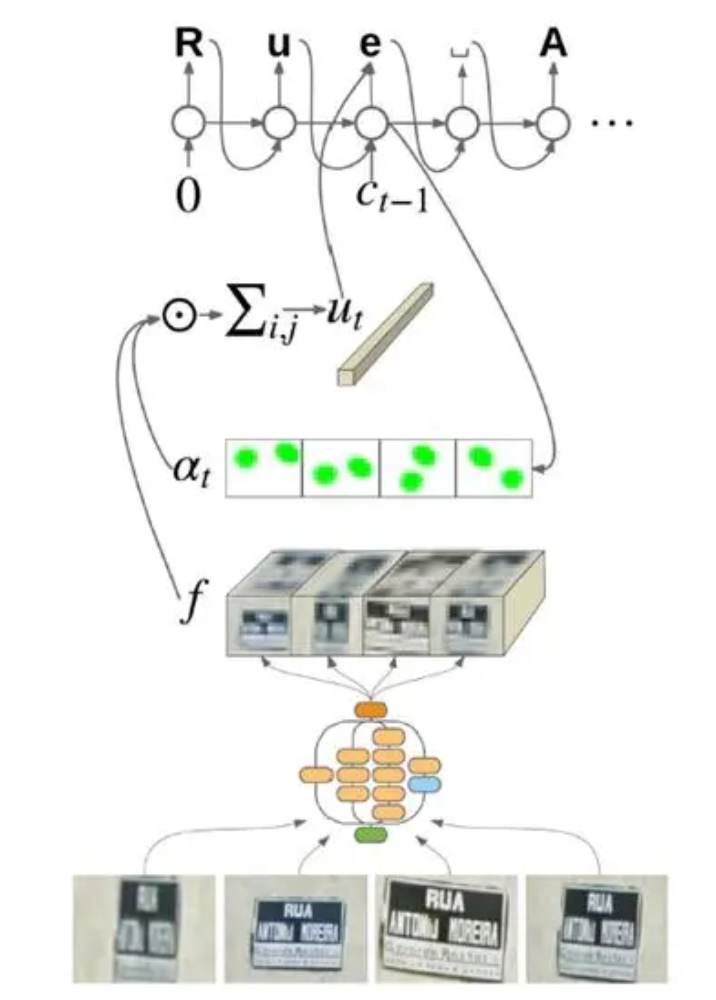

[11] Wojna Z, Gorban A N, Lee D S, et al. Attention-Based Extraction of Structured Information from Street View Imagery[J]. 2017:844-850.

## 端到端的OCR

与检测-识别的多阶段OCR不同，深度学习使端到端的OCR成为可能，将文本的检测和识别统一到同一个工作流中。目前比较受到瞩目的一种端到端框架叫做FOTS(Fast Oriented Text Spotting)。FOTS的检测任务和识别任务共享卷积特征图。一方面利用卷积特征进行检测，另一方面引入了RoIRotate，一种用于提取定向文本区域的算符。得到文本候选特征后，将其输入到RNN编码器和CTC解码器中进行识别。同时，由于所有算符都是可微的，因此端到端的网络训练成为可能。由于简化了工作流，网络可以在极低运算开销下进行验证，达到实时速度。[12]

下图为FOTS的总体结构[12]

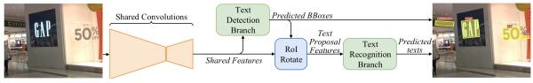

[12] Liu X, Liang D, Yan S, et al. FOTS: Fast Oriented Text Spotting with a Unified Network[J]. 2018.